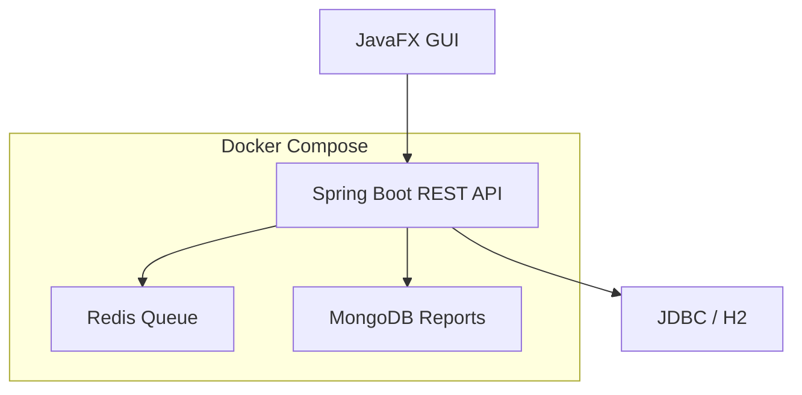

# GamerMatch

A Dockerized advanced Java project for player matchmaking, team and tournament management, and match reporting. The system combines a Spring Boot REST API, JavaFX desktop UI, JDBC/H2, Redis, MongoDB, and load-test documentation.

## Features

- REST API for users, teams, tournaments, matchmaking, and match reports
- JavaFX desktop client with custom Canvas drawings
- JDBC/H2 layer for relational data
- Redis layer for matchmaking queue and lobby data
- MongoDB layer for flexible match report documents
- Centralized API response model and exception handling
- k6 and JMeter performance test scenarios
- Docker Compose setup for API, Redis, and MongoDB

## Tech Stack

| Area | Technology |
|------|------------|
| Language | Java 17 |
| Backend | Spring Boot |
| Desktop UI | JavaFX |
| SQL | JDBC + H2 |
| NoSQL | Redis, MongoDB |
| Build | Maven |
| Performance | k6, JMeter |
| Containerization | Docker Compose |

## Architecture



## Project Structure

```text
src/main/java/com/gamermatch/
  common/    shared API response, paging, health, exception handling
  jdbc/      users, teams, tournaments
  redis/     matchmaking queue and lobby storage
  mongo/     match report documents
  gui/       JavaFX UI and custom Canvas components
docs/        architecture, project, and performance reports
performance/ k6 and JMeter test files
```

## Run With Docker

Start the API, Redis, and MongoDB together:

```powershell
docker compose up --build
```

Run in the background:

```powershell
docker compose up --build -d
```

Check service status:

```powershell
docker compose ps
```

Stop the system:

```powershell
docker compose down
```

Remove containers and MongoDB volume data:

```powershell
docker compose down -v
```

## Data Storage

| Data | Docker behavior |
|------|-----------------|
| H2 SQL data | In-memory inside the API container; resets when API restarts |
| Redis data | In-memory inside the Redis container; resets when Redis restarts |
| MongoDB data | Stored in Docker volume `mongo-data`; persists after `docker compose down` |

When the project is started with Docker Compose, it uses the Redis and MongoDB containers defined in `docker-compose.yml`, not local Redis or MongoDB services installed on the host machine.

## Health Check

```powershell
Invoke-RestMethod http://localhost:8080/api/health
```

Expected response:

```json
{
  "success": true,
  "message": "OK",
  "data": {
    "status": "UP",
    "app": "GamerMatch"
  }
}
```

## API Examples

Create a user:

```powershell
Invoke-RestMethod -Method POST -Uri http://localhost:8080/api/users `
  -ContentType "application/json" `
  -Body '{"username":"ali","email":"ali@test.com","password":"1234","gameRank":"Gold"}'
```

List users:

```powershell
Invoke-RestMethod http://localhost:8080/api/users
```

Join matchmaking queue:

```powershell
Invoke-RestMethod -Method POST -Uri http://localhost:8080/api/matchmaking/join `
  -ContentType "application/json" `
  -Body '{"playerId":"1","game":"VALORANT","rank":"Gold"}'
```

Create a match:

```powershell
Invoke-RestMethod -Method POST -Uri http://localhost:8080/api/matchmaking/match/VALORANT
```

Create a tournament:

```powershell
Invoke-RestMethod -Method POST -Uri http://localhost:8080/api/tournaments `
  -ContentType "application/json" `
  -Body '{"name":"Spring Cup","game":"VALORANT"}'
```

## Performance Test

Run the k6 load test after the API is running:

```powershell
k6 run performance/k6-load-test.js
```

The k6 script first checks `/api/health`. If the API is not running on `localhost:8080`, it fails early with a clear message.

### k6 Test Output


Latest measured k6 result:

| Metric | Result |
|--------|--------|
| Total HTTP requests | 1767 |
| Successful checks | 1767 |
| Failed checks | 0 |
| Error rate | 0% |
| Average response time | 1.76 ms |
| p95 response time | 3.59 ms |
| Max response time | 19.22 ms |
| Request rate | 44.09 req/s |

Detailed report: [docs/PERFORMANCE_REPORT.md](docs/PERFORMANCE_REPORT.md)

## JMeter

The JMeter scenario is available at:

```text
performance/jmeter-gamermatch.jmx
```

Run it with:

```powershell
jmeter -n -t performance/jmeter-gamermatch.jmx -l performance/results.jtl
```

## Documentation

- [Architecture](docs/ARCHITECTURE.md)
- [Project Report](docs/PROJECT_REPORT.md)
- [Performance Report](docs/PERFORMANCE_REPORT.md)
