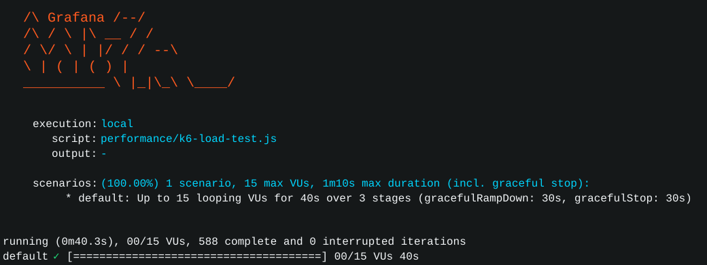

# GamerMatch

GamerMatch; oyuncu eşleştirme, takım/turnuva yönetimi ve maç raporlama için geliştirilmiş ileri Java projesidir. Proje artık **mikroservis mimarisi** ve **gateway** yapısı ile Docker Compose üzerinde çalışacak şekilde düzenlenmiştir.

## Mikroservis ve Gateway Farkı

Mikroservis mimarisi, tek bir monolitik API yerine iş alanlarını ayrı Spring Boot servislerine böler. Bu projede kullanıcı/takım, turnuva, matchmaking ve raporlama ayrı servislerdir.

Gateway ise dışarıdan gelen tüm istekleri karşılayan giriş kapısıdır. Kullanıcı veya k6 testi sadece gateway'e istek atar; gateway isteği doğru mikroservise yönlendirir.

```text
Kullanıcı / k6
     |
     v
Gateway Service :8080
     |
     +--> User Service :8081
     +--> Tournament Service :8082
     +--> Matchmaking Service :8083
     +--> Report Service :8084
```

## Servisler

| Servis | Port | Görev | Veri Katmanı |
|--------|------|-------|--------------|
| `gateway-service` | 8080 | Tüm `/api/**` trafiğini yönlendirir | Yok |
| `user-service` | 8081 | Kullanıcı ve takım yönetimi | JDBC + H2 |
| `tournament-service` | 8082 | Turnuva yönetimi | JDBC + H2 |
| `matchmaking-service` | 8083 | Oyuncu kuyruğu ve lobi oluşturma | Redis |
| `report-service` | 8084 | Maç raporları | MongoDB |
| `redis` | 6379 | Kuyruk ve geçici lobi verisi | Redis RAM |
| `mongo` | 27017 | Maç raporu dokümanları | Docker volume |

Matchmaking servisi, oyuncuyu kuyruğa almadan önce `user-service` üzerinden JSON/HTTP ile kullanıcı kontrolü yapar. Bu servisler arası haberleşmeyi gösterir.

## Teknolojiler

| Alan | Teknoloji |
|------|-----------|
| Dil | Java 17 |
| Backend | Spring Boot |
| Gateway | Spring Cloud Gateway |
| Masaüstü arayüz | JavaFX |
| SQL | JDBC + H2 |
| NoSQL | Redis, MongoDB |
| Build | Maven |
| Performans | k6, JMeter |
| Container | Docker Compose |

## Proje Yapısı

```text
services/
  gateway-service/       Spring Cloud Gateway
  user-service/          Kullanıcı ve takım API
  tournament-service/    Turnuva API
  matchmaking-service/   Redis tabanlı eşleştirme API
  report-service/        MongoDB tabanlı rapor API

src/main/java/           Eski monolitik uygulama ve JavaFX istemci
docs/                    Mimari ve performans raporları
performance/             k6 ve JMeter testleri
```

Eski monolitik kaynak kodu korunmuştur. Mikroservis mimarisi `services/` klasörü altında ayrı uygulamalar olarak kurulmuştur.

## Docker ile Çalıştırma

Docker Desktop açık olmalıdır.

```powershell
docker compose up --build
```

Arka planda çalıştırmak için:

```powershell
docker compose up --build -d
```

Servisleri görmek için:

```powershell
docker compose ps
```

Logları izlemek için:

```powershell
docker compose logs -f gateway-service
```

Sistemi durdurmak için:

```powershell
docker compose down
```

MongoDB volume verisini de silmek için:

```powershell
docker compose down -v
```

## Docker'da Veri Nerede Saklanır?

| Veri | Saklama Davranışı |
|------|-------------------|
| H2 kullanıcı/takım verisi | Servis belleğinde, servis yeniden başlayınca sıfırlanır |
| H2 turnuva verisi | Servis belleğinde, servis yeniden başlayınca sıfırlanır |
| Redis kuyruk verisi | Redis container RAM'inde, container kapanınca sıfırlanır |
| MongoDB rapor verisi | `mongo-data` Docker volume içinde kalıcı tutulur |

Docker ile çalıştırıldığında proje local bilgisayardaki Redis veya MongoDB servislerini kullanmaz. Docker Compose içindeki `redis` ve `mongo` container'larına bağlanır. RAM ve CPU yine bilgisayarından tüketilir, fakat servisler izole container'lar içinde çalışır.

## Gateway Üzerinden Test

Gateway dışarıya `localhost:8080` olarak açılır.

```powershell
Invoke-RestMethod http://localhost:8080/api/health
```

Kullanıcı oluştur:

```powershell
Invoke-RestMethod -Method POST -Uri http://localhost:8080/api/users `
  -ContentType "application/json" `
  -Body '{"username":"ali","email":"ali@test.com","password":"1234","gameRank":"Gold"}'
```

Kullanıcıları listele:

```powershell
Invoke-RestMethod http://localhost:8080/api/users
```

Turnuva oluştur:

```powershell
Invoke-RestMethod -Method POST -Uri http://localhost:8080/api/tournaments `
  -ContentType "application/json" `
  -Body '{"name":"Bahar Kupası","game":"VALORANT"}'
```

Matchmaking kuyruğuna gir:

```powershell
Invoke-RestMethod -Method POST -Uri http://localhost:8080/api/matchmaking/join `
  -ContentType "application/json" `
  -Body '{"playerId":"1","game":"VALORANT","rank":"Gold"}'
```

Not: Matchmaking servisi `playerId` değerini `user-service` üzerinden kontrol eder. Bu yüzden önce kullanıcı oluşturulmalıdır.

## Localde Docker Olmadan Çalıştırma

Bu yapı sadece Docker'a bağlı değildir. Her mikroservis localde kendi portunda çalışabilir.

Örnek:

```powershell
cd services/user-service
mvn spring-boot:run
```

Diğer servisler:

```text
gateway-service       8080
user-service          8081
tournament-service    8082
matchmaking-service   8083
report-service        8084
```

Local çalıştırmada Redis `localhost:6379`, MongoDB `localhost:27017` üzerinde açık olmalıdır.

## Performans Testi

API Docker veya local olarak çalışırken:

```powershell
k6 run performance/k6-load-test.js
```

Test gateway'e, yani `http://localhost:8080` adresine istek atar.



Son ölçülen k6 sonucu:

| Metrik | Sonuç |
|--------|-------|
| Toplam HTTP isteği | 1767 |
| Başarılı check | 1767 |
| Hatalı check | 0 |
| Hata oranı | 0% |
| Ortalama cevap süresi | 1.76 ms |
| p95 cevap süresi | 3.59 ms |
| İstek hızı | 44.09 req/s |

Detaylı rapor: [docs/PERFORMANCE_REPORT.md](docs/PERFORMANCE_REPORT.md)

## Dokümanlar

- [Mimari](docs/ARCHITECTURE.md)
- [Proje Raporu](docs/PROJECT_REPORT.md)
- [Performans Raporu](docs/PERFORMANCE_REPORT.md)
