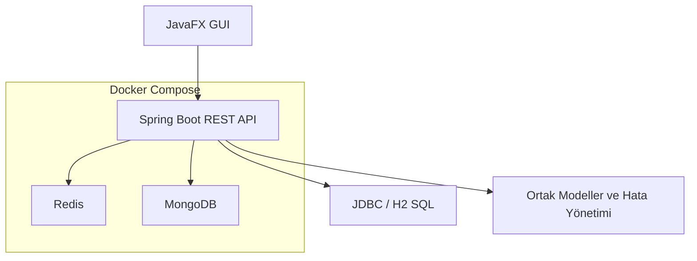

# Mimari

## Paketler

| Paket | Görev |
|-------|-------|
| `common` | Generic cevap modeli, sayfalı liste, health endpoint'i ve merkezi hata yönetimi |
| `jdbc` | Kullanıcı, takım ve turnuva verileri için SQL katmanı |
| `redis` | Anlık matchmaking kuyruğu ve lobi saklama |
| `mongo` | Esnek maç raporları ve oyuncu istatistikleri |
| `gui` | JavaFX masaüstü arayüz ve custom Canvas çizimleri |

## Veri katmanı seçimi

- **JDBC/H2:** Sabit şemalı kullanıcı, takım ve turnuva kayıtları.
- **Redis:** Hızlı, geçici ve kuyruk odaklı matchmaking verisi.
- **MongoDB:** Oyun bazlı değişebilen JSON maç istatistikleri.

## Çalıştırma modeli

Docker Compose, API, Redis ve MongoDB servislerini birlikte başlatır. API konteyneri Redis'e `redis:6379`, MongoDB'ye `mongodb://mongo:27017/gamermatch` adresiyle bağlanır.

Yerel geliştirmede aynı uygulama `application.yml` varsayılanlarıyla `localhost:6379` ve `localhost:27017` servislerini kullanır.
