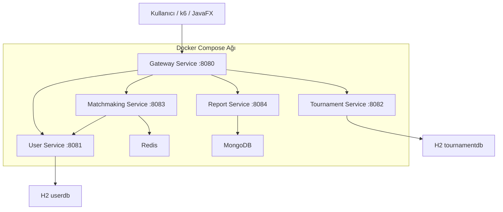

# Mimari

Proje, monolitik API yerine Docker Compose ile ayağa kalkan mikroservis mimarisi ve gateway katmanı içerir.



## Mikroservisler

| Servis | Sorumluluk | Bağımlılık |
|--------|------------|------------|
| `gateway-service` | Dış trafiği ilgili servise yönlendirme | Spring Cloud Gateway |
| `user-service` | Kullanıcı ve takım yönetimi | JDBC/H2 |
| `tournament-service` | Turnuva yönetimi | JDBC/H2 |
| `matchmaking-service` | Kuyruk ve lobi yönetimi | Redis, user-service |
| `report-service` | Maç raporu saklama | MongoDB |

## Gateway Yönlendirmeleri

| Path | Hedef servis |
|------|--------------|
| `/api/health` | `user-service` |
| `/api/users/**` | `user-service` |
| `/api/teams/**` | `user-service` |
| `/api/tournaments/**` | `tournament-service` |
| `/api/matchmaking/**` | `matchmaking-service` |
| `/api/match-reports/**` | `report-service` |

## Servisler Arası JSON Haberleşme

`matchmaking-service`, oyuncuyu kuyruğa almadan önce `user-service` üzerinden HTTP/JSON çağrısı yapar:

```text
matchmaking-service -> GET http://user-service:8081/api/users/{playerId}
```

Bu kontrol başarılı olursa oyuncu Redis kuyruğuna eklenir.

## Docker ve Local Çalışma

Docker Compose ile çalıştırıldığında servisler aynı Docker ağı içindedir ve birbirlerine servis adlarıyla erişir:

```text
http://user-service:8081
http://tournament-service:8082
http://matchmaking-service:8083
http://report-service:8084
```

Local çalıştırmada aynı servisler kendi portlarından erişilebilir:

```text
http://localhost:8081
http://localhost:8082
http://localhost:8083
http://localhost:8084
```
