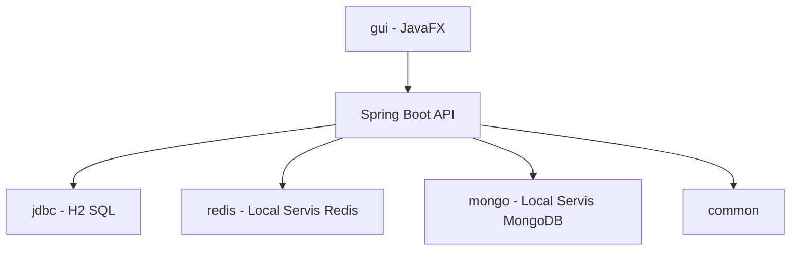

# Mimari

## Paketler

| Paket | Gorev |
|-------|-------|
| common | Generic, hata, health, gomulu redis baslatma |
| jdbc | Kalici SQL verileri |
| redis | Anlik eslestirme kuyrugu |
| mongo | Esnek mac raporlari |
| gui | Masaustu arayuz |

## Neden 3 veri katmani?

- **jdbc:** Sabit tablo, kalici profil/turnuva
- **redis:** Hizli, gecici kuyruk
- **mongo:** Oyun basina farkli JSON istatistik

Hepsi gercek motor; uygulama ile birlikte acilir, Docker gerekmez.
